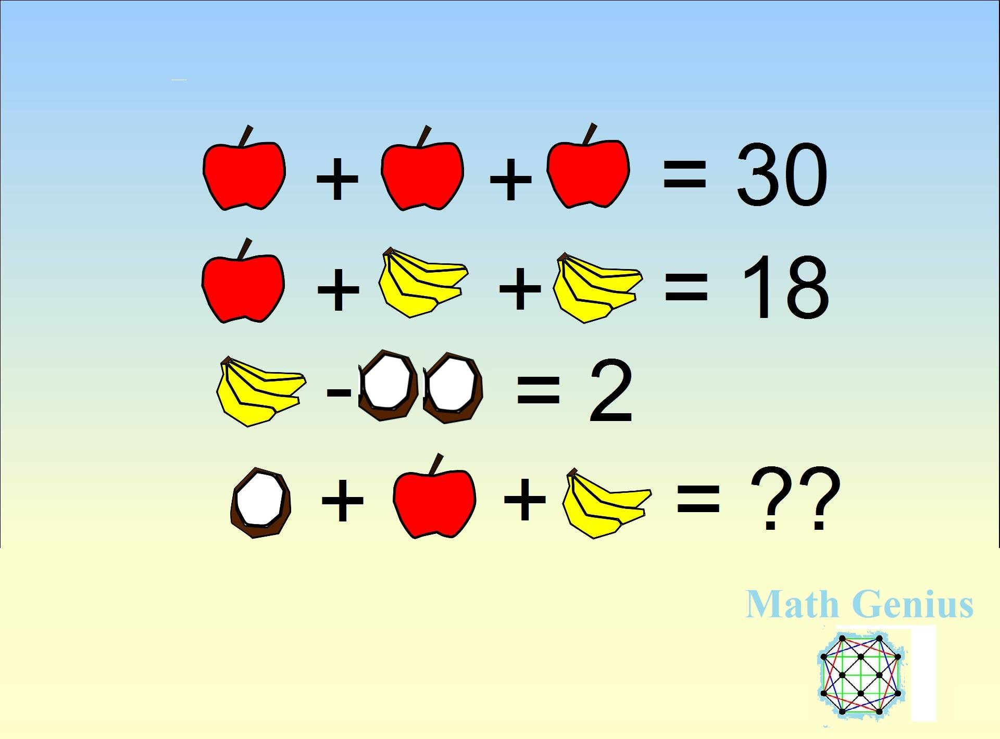
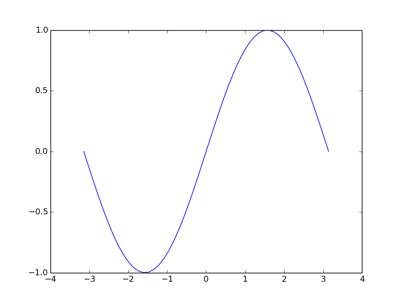
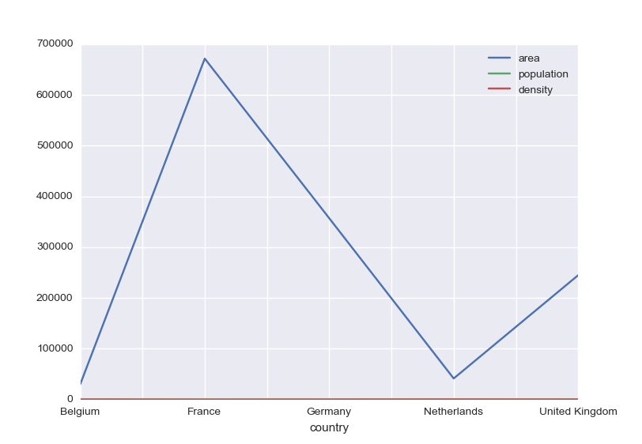
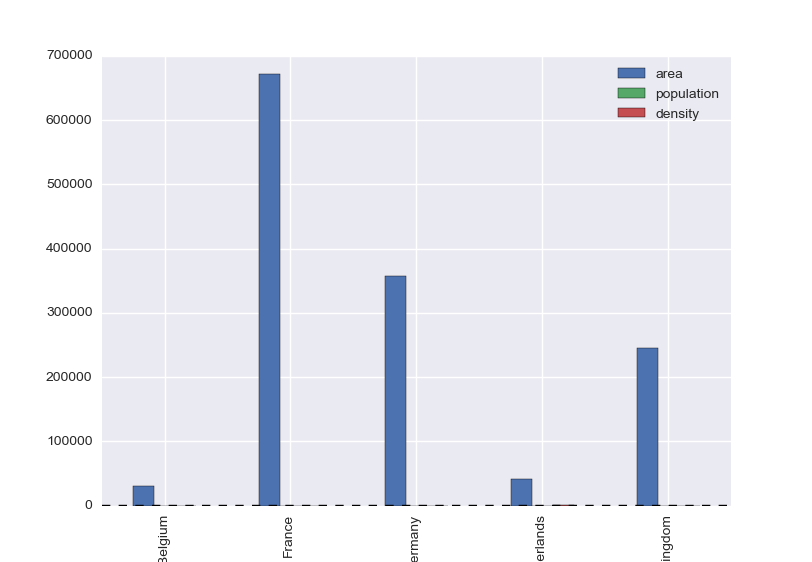

# Libraries

---

* The builtins
* The standard library
* Third-party libraries (PyPI)

## The builtins

* functions, types, and constants that are always available e.g.
    - functions: print, len
    - types: int, float, str, list, set, dict, tuple
    - constants: True, False, None

---

## The standard library

a minimal tour of commonly used modules

* General reference : https://docs.python.org/3/library/index.html
* A wide collection of modules and packages that come with Python
* Libraries that are not builtin but are always available via the `import` statement

Examples:

- `math` for mathematical functions
- `datetime` for date and time manipulation
- `os` for operating system interfaces
- `sys` for system-specific parameters and functions
- `json` for JSON encoding and decoding
- `re` for regular expressions

---

### The math module

* Provides mathematical elmentary functions and constants

~~~
>>> import math
>>> dir(math)
[...'acos', 'acosh', 'asin', 'asinh', 'atan', 'atan2', 'atanh', 'cbrt', 'ceil', 'comb', 'copysign', 'cos', 'cosh', 'degrees', 'dist', 'e', 'erf', 'erfc', 'exp', 'exp2', 'expm1', 'fabs', 'factorial', 'floor', 'fma', 'fmod', 'frexp', 'fsum', 'gamma', 'gcd', 'hypot', 'inf', 'isclose', 'isfinite', 'isinf', 'isnan', 'isqrt', 'lcm', 'ldexp', 'lgamma', 'log', 'log10', 'log1p', 'log2', 'modf', 'nan', 'nextafter', 'perm', 'pi', 'pow', 'prod', 'radians', 'remainder', 'sin', 'sinh', 'sqrt', 'sumprod', 'tan', 'tanh', 'tau', 'trunc', 'ulp']

~~~

~~~
>>> import math
>>> math.pi
3.141592653589793
>>> math.sqrt(81)
9.0

~~~

---

### datetime

* Provides datatypes for manipulating dates and times

~~~
>>> import datetime
>>> dir(datetime)
[..., 'date', 'datetime', 'datetime_CAPI', 'time', 'timedelta', 'timezone', 'tzinfo']

~~~

* note that the `datetime` module has a `datetime` datatype : `datetime` (confusing)

~~~
>>> now = datetime.datetime(2026, 4, 13, 9, 15)
>>> now
datetime.datetime(2026, 4, 13, 9, 15)
>>> print(now)
2026-04-13 09:15:00

~~~

---

### os

* Various operating system features

~~~
>>> import os
>>> os.getenv("USER") # get current working directory
'olav'
>>> os.getenv("HOME") # get home directory
'/home/olav'
>>> os.makedirs("a/b/c", exist_ok=True)

~~~
~~~bash
$ tree a
a
└── b
    └── c

3 directories, 0 files
0
~~~

`os.path` is a subpackage related to file path manipulation, but it is
preferred to use the more modern `pathlib` module instead for this.

---

### sys

* System-specific parameters and functions
* `sys.argv` is a list of command-line arguments passed to the script
* `sys.stdin` for standard input (normally keyboard)
* `sys.stdout` for standard output (normally terminal)

---

### collections

* High-performance container datatypes

~~~
>>> import collections

~~~

#### namedtuple

* `namedtuple` tuple-like datatype with named fields

c.f normal tuple vs. namedtuple

~~~
>>> book = ("Automate the Boring Stuff with Python", "Al Sweigart", 2015)
>>> book[1]
'Al Sweigart'

~~~
~~~
>>> Book = collections.namedtuple("Book", "title author year")
>>> book = Book("Automate the Boring Stuff with Python", "Al Sweigart", 2015)
>>> book.author
'Al Sweigart'

~~~

---

#### Counter

* simplifies counting of objects

~~~
>>> collections.Counter('ABBA')
Counter({'A': 2, 'B': 2})
>>> collections.Counter('hello hello'.split())
Counter({'hello': 2})

~~~

#### defaultdict

* simplifies handling of missing keys in dictionaries
* provides a default value for missing keys

~~~
>>> normaldict = {}
>>> normaldict.get('key')

~~~

~~~
>>> defaultdict = collections.defaultdict(list)
>>> defaultdict['key'].append('value')
>>> defaultdict
defaultdict(<class 'list'>, {'key': ['value']})

~~~

---

### functools

* Higher-order functions and operations on functions

#### partial

* Creates a new function with some arguments fixed

~~~
>>> import functools
>>> print1 = functools.partial(print, sep='\n')
>>> print1("Hello", "World")
Hello
World

~~~

#### cache

* Save results of previous called that can be recalled with same arguments

<!--
~~~
>>> def slow_function(x):
...     pass

~~~
-->

~~~
>>> slow_function = functools.cache(slow_function)
>>> slow_function(10) # takes a long time
>>> slow_function(10) # returns immediately with cached result

~~~

---

### argparse

* Parse command-line arguments insted of handling  `sys.argv` directly
* Automatic help generation

In script:

~~~
#hello.py
import argparse
parser = argparse.ArgumentParser(description="A simple script")
parser.add_argument("name", help="Your name")
parser.add_argument("--age", type=int, help="Your age")
args = parser.parse_args()
print(args)
~~~

In terminal:
~~~bash
$ python hello.py -h
usage: hello.py [-h] [--age AGE] name
$ python hello.py Alice --age 30
Namespace(name='Alice', age=30)

~~~

---

### csv
~~~
>>> import csv

~~~
* Handling of tabular data in CSV format

prices.csv
~~~
item,price_per_item,number_of_items
apple,0.5,1
banana,0.3,2
orange,0.7,4
~~~

~~~
>>> for line in csv.reader(open("prices.csv")):
...     print(line)
['item', 'price_per_item', 'number_of_items']
['apple', '0.5', '1']
['banana', '0.3', '2']
['orange', '0.7', '4']

~~~

~~~
>>> for line in csv.DictReader(open("prices.csv")):
...     print(line)
{'item': 'apple', 'price_per_item': '0.5', 'number_of_items': '1'}
{'item': 'banana', 'price_per_item': '0.3', 'number_of_items': '2'}
{'item': 'orange', 'price_per_item': '0.7', 'number_of_items': '4'}

~~~

---

### pathlib
~~~
>>> import pathlib

~~~

* Object-oriented filesystem paths
* Improvements over `os.path` for path manipulation
* Platform independent path handling

~~~
>>> path = pathlib.Path("a") / "b" / "c"
>>> path
PosixPath('a/b/c')
>>> path.exists()
True
>>> path.parent
PosixPath('a/b')
>>> str(path.name)
'c'

~~~

---

# External libraries

* numpy
* pandas
* matplotlib

---

## What can you do with Python libraries

*This year’s Nobel Prize in economics was awarded to a Python convert*

https://qz.com/1417145/economics-nobel-laureate-paul-romer-is-a-python-programming-convert/

*Instead of using Mathematica, Romer discovered that he could use a Jupyter
notebook for sharing his research. <mark>Jupyter notebooks</mark> are web
applications that allow programmers and researchers to share documents that
include code, charts, equations, and data. Jupyter notebooks allow for code
written in dozens of programming languages. For his research, Romer used
<mark>Python—the most popular language for data science and statistics.</mark>*

---
## What can you do with Python libraries

*Take a picture of a black hole*

https://doi.org/10.3847/2041-8213/ab0e85

*Software: DiFX (Deller et al. 2011), CALC, PolConvert (Martí-Vidal et al.  2016), HOPS (Whitney et al. 2004), CASA (McMullin et al. 2007), AIPS (Greisen 2003), ParselTongue (Kettenis et al. 2006), GNU Parallel (Tange 2011), GILDAS, eht-imaging (Chael et al. 2016, 2018), <mark>Numpy</mark> (van der Walt et al.  2011), <mark>Scipy</mark> (Jones et al. 2001), <mark>Pandas</mark> (McKinney 2010), Astropy (The Astropy Collaboration et al. 2013, 2018), <mark>Jupyter</mark> (Kluyver et al. 2016), <mark>Matplotlib</mark> (Hunter 2007).*

---

## Are you a math genius?

* First three rows a linear system of equations
* Identify the coefficient matrix and right-hand side
* Last line represents an expression of the solutions

$$
\begin{pmatrix}
3 &0 &0 \\\
1 &8 &0 \\\
0 &4 &-2
\end{pmatrix}
\begin{pmatrix}
a\\\ b \\\ c
\end{pmatrix}
=
\begin{pmatrix}
30\\\ 18 \\\ 2
\end{pmatrix}
$$
$$
a + 3b + c = ?
$$

---

### Linear Algebra in Python: NumPy

* Libraries provided by ``numpy`` provide computational speeds close to compiled languages
* Generally written in C
* From a user perspective they are imported as any python module
* https://www.numpy.org

---

### Creating arrays

* one- and two-dimensional

~~~
>>> import numpy
>>> a = numpy.zeros(3)
>>> a  # doctest: +NORMALIZE_WHITESPACE 
array([0., 0., 0.])
>>> b = numpy.zeros((3, 3))
>>> b  # doctest: +NORMALIZE_WHITESPACE 
array([[0., 0., 0.],
       [0., 0., 0.],
       [0., 0., 0.]])

~~~

---

### Copying arrays

~~~
>>> x = numpy.zeros(2)
>>> y = x
>>> x[0] = 1
>>> x
array([1., 0.])
>>> y
array([1., 0.])

~~~
    
Note that assignment (like lists) here is by reference

~~~
>>> x is y
True

~~~

Numpy array copy method

~~~
>>> y = x.copy()
>>> x is y
False

~~~

---

### Filling arrays

``linspace`` returns an array with sequence data

~~~
>>> numpy.linspace(0,1,6) # doctest: +NORMALIZE_WHITESPACE 
array([0. , 0.2, 0.4, 0.6, 0.8, 1. ])

~~~

``arange`` is a similar function
~~~
>>> numpy.arange(0, 1, 0.2) # doctest: +NORMALIZE_WHITESPACE 
array([0. , 0.2, 0.4, 0.6, 0.8])

~~~

---

### Arrays from list objects

~~~
>>> la=[1., 2., 3.]
>>> a=numpy.array(la)
>>> a
array([1., 2., 3.])

~~~

~~~
>>> lb=[4., 5., 6.]
>>> ab=numpy.array([la,lb])
>>> ab
array([[1., 2., 3.],
       [4., 5., 6.]])

~~~

---

### Arrays from file data:

* Using `numpy.loadtxt`

~~~
#a.dat
1 2 3
4 5 6
~~~

<!--
>>> with open('a.dat', 'w') as adat:
...     n = adat.write('1 2 3\n4 5 6\n')

-->

~~~
>>> a = numpy.loadtxt('a.dat')
>>> a
array([[1., 2., 3.],
       [4., 5., 6.]])

~~~
If you have a text file with only numerical data
arranged as a matrix: all rows have the same number of elements

---

### Reshaping

by changing the shape attribute

~~~
>>> ab.shape
(2, 3)
>>> ab = ab.reshape((6,))
>>> ab.shape
(6,)

~~~

with the reshape method

~~~
>>> ba = ab.reshape((3, 2))
>>> ba
array([[1., 2.],
       [3., 4.],
       [5., 6.]])

~~~
---

### Views of same data

* ab and ba are different objects but represent different views  of the same data

~~~
>>> ab[0] = 0
>>> ab
array([0., 2., 3., 4., 5., 6.])
>>> ba
array([[0., 2.],
       [3., 4.],
       [5., 6.]])

~~~
---

### Array indexing and slicing

like lists

* ``a[2: 4]`` is an array slice with elements ``a[2]`` and ``a[3]``
* ``a[n: m]`` has size ``m-n``
* ``a[-1]`` is the last element of ``a``
* ``a[:]`` are all elements of ``a``

---

### Matrix operations

From mathematics:

\[C_{ij} = \sum_k A_{ik}B_{kj}\]

explicit looping (slow):

~~~
import time

import numpy

n = 256
a = numpy.ones((n, n))
b = numpy.ones((n, n))
c = numpy.zeros((n, n))
t1 = time.time()
for i in range(n):
    for j in range(n):
        for k in range(n):
            c[i, j] += a[i, k]*b[k, j]
t2 = time.time()
print("Loop timing", t2-t1)
~~~

---

* using numpy

~~~
import time

import numpy

n = 256
a = numpy.ones((n, n))
b = numpy.ones((n, n))
t1 = time.clock()
c = a @ b
t2 = time.clock()
print("dot timing", t2-t1)
~~~

`@` is a matrix multiplication operator, same as

~~~
c = numpy.dot(a, b)
~~~

---

### More vector operations

* Scalar multiplication ``a * 2`` 
* Scalar addition ``a + 2``
* Power (elementwise) ``a**2``

Note that for objects of ``ndarray`` type, multiplication means elementwise multplication and not matrix multiplication

---

### Vectorized elementary functions

~~~
>>> v = numpy.arange(0, 1, .2)
>>> v
array([0. , 0.2, 0.4, 0.6, 0.8])

~~~
--
~~~
>>> numpy.cos(v)
array([1.        , 0.98006658, 0.92106099, 0.82533561, 0.69670671])

~~~
--
~~~
>>> numpy.sqrt(v)
array([0.        , 0.4472136 , 0.63245553, 0.77459667, 0.89442719])

~~~
--
~~~
>>> numpy.log(v) # doctest: +ELLIPSIS
...
array([       -inf, -1.60943791, -0.91629073, -0.51082562, -0.22314355])

~~~

---

## More linear algebra

* Solve a linear  system of equations
$$Ax = b$$

--

~~~
    x = numpy.linalg.solve(A, b)

~~~

--

* Determinant of a matrix

$$det(A)$$

--

~~~
    x = numpy.linalg.det(A)

~~~

---

* Inverse of a matrix 
$$A^{-1}$$

--

~~~
    x = numpy.linalg.inverse(A)

~~~

--

*  Eigenvalues  of a matrix

$$Ax = x\lambda$$

--

~~~
    x, l = numpy.linalg.eig(A)

~~~

---

## References

* https://www.numpy.org
* https://www.scipy-lectures.org/intro/numpy/index.html
* Videos: https://pyvideo.org/search.html?q=numpy

---

## Matplotlib

- The standard 2D-plotting library in Python
- Production-quality graphs
- Interactive and non-interactive use
- Many output formats
- Flexible and customizable

---

## First example

### The absolute minimum  you need to know

* You have a set of points (x,y) on file `data.txt`

~~~
-3.141593 -0.000000
-3.013364 -0.127877
-2.885136 -0.253655
...
3.141593 0.000000
~~~
--

* How do you get to  this

---

### Next

* Import the plotting library

~~~
>>> import matplotlib.pyplot as plt
>>> import numpy as np

~~~

--

* Load the data from file

~~~
>>> data = np.loadtxt('data.txt') # doctest: +SKIP 

~~~
--

* Call the `plot` function

~~~
>>> plt.plot(data[:, 0], data[:, 1]) # doctest: +SKIP 

~~~
--

* Show the result

~~~
>>> plt.show() # doctest: +SKIP 

~~~

---

### Next? 

#### Refinement

* Change color, linestyle, linewidth
--

* Change window size (ylim)
--

* Change xticks
--

* Set title
--

* Multi-line plots
--

* Legends

---

### In practice

How do you do when need a particlar type of figure?

* Go to the matplotlib gallery: https://matplotlib.org/gallery
* Try some exercises at https://scipy-lectures.github.io/intro/matplotlib/matplotlib.html#other-types-of-plots-examples-and-exercises
* See also: https://realpython.com/python-matplotlib-guide/

---

## The `pandas` module

Setup:

~~~
>>> import pandas as pd
>>> import numpy as np
>>> import matplotlib.pyplot as plt

~~~

Two main data structures

* Series
* Data frames
---

### Series

One-dimensional labeled data

~~~
>>> s = pd.Series([0.1, 0.2, 0.3, 0.4])
>>> print(s)
0    0.1
1    0.2
2    0.3
3    0.4
dtype: float64

~~~
--
~~~
>>> s.index
RangeIndex(start=0, stop=4, step=1)

~~~
--
~~~
>>> s.values
array([0.1, 0.2, 0.3, 0.4])

~~~

---

* indices can be labels (like a dict with order)

~~~
>>> s = pd.Series(np.arange(4), index=['a', 'b', 'c', 'd'])
>>> print(s)
a    0
b    1
c    2
d    3
dtype: int64
>>> print(s['d'])
3
>>>
~~~
--
* Initialize with dict

~~~
>>> s = pd.Series({'a': 1, 'b': 2, 'c': 3, 'd': 4})
>>> print(s)
a    1
b    2
c    3
d    4
dtype: int64

~~~
--
* Indexing as a dict

~~~
>>> print(s['a'])
1

~~~
---

* Elementwise operations
~~~
>>> s * 100
a    100
b    200
c    300
d    400
dtype: int64
>>>
~~~
--

* Slicing
~~~
>>> s['b': 'c']
b    2
c    3
dtype: int64
>>>
~~~

---

* List indexing
~~~
>>> print(s[['b', 'c']])
b    2
c    3
dtype: int64
>>>
~~~
--

* Bool indexing
~~~
>>> print(s[s>2])
c    3
d    4
dtype: int64
>>>
~~~
--

* Other operations
~~~
>>> s.mean()
2.5
>>>
~~~
---

* Alignment on indices

~~~
>>> s['a':'b'] + s['b':'c']  # doctest: +NORMALIZE_WHITESPACE 
a   NaN
b   4.0
c   NaN
dtype: float64

~~~

---

### DataFrames

* Tabular data structure (like spreadsheet, sql table)
* Multiple series with common index

~~~
>>> data = {'country': ['Belgium', 'France', 'Germany', 'Netherlands', 'United Kingdom'],
...        'population': [11.3, 64.3, 81.3, 16.9, 64.9],
...        'area': [30510, 671308, 357050, 41526, 244820],
...        'capital': ['Brussels', 'Paris', 'Berlin', 'Amsterdam', 'London']}
>>>
~~~
--
~~~
>>> countries = pd.DataFrame(data)
>>> countries
          country  population    area    capital
0         Belgium        11.3   30510   Brussels
1          France        64.3  671308      Paris
2         Germany        81.3  357050     Berlin
3     Netherlands        16.9   41526  Amsterdam
4  United Kingdom        64.9  244820     London

~~~

---

* Attributes: index, columns, dtypes, values

~~~
>>> countries.index
RangeIndex(start=0, stop=5, step=1)

~~~
--
~~~
>>> countries.columns
Index(['country', 'population', 'area', 'capital'], dtype='object')

~~~
--

~~~
>>> countries.dtypes
country        object
population    float64
area            int64
capital        object
dtype: object
>>>
~~~

--

~~~
>>> countries.values
array([['Belgium', 11.3, 30510, 'Brussels'],
       ['France', 64.3, 671308, 'Paris'],
       ['Germany', 81.3, 357050, 'Berlin'],
       ['Netherlands', 16.9, 41526, 'Amsterdam'],
       ['United Kingdom', 64.9, 244820, 'London']], dtype=object)

~~~
---
* Info

~~~
>>> countries.info()
<class 'pandas.core.frame.DataFrame'>
RangeIndex: 5 entries, 0 to 4
Data columns (total 4 columns):
 #   Column      Non-Null Count  Dtype  
---  ------      --------------  -----  
 0   country     5 non-null      object 
 1   population  5 non-null      float64
 2   area        5 non-null      int64  
 3   capital     5 non-null      object 
dtypes: float64(1), int64(1), object(2)
memory usage: 288.0+ bytes

RangeInde: 5 entries, 0 to 4
Data columns (total 4 columns):
area          5 non-null int64
capital       5 non-null object
country       5 non-null object
population    5 non-null float64
dtypes: float64(1), int64(1), object(2)
memory usage: 200.0 bytes
>>>
~~~
---

* Set a column as index

~~~
>>> countries
          country  population    area    capital
0         Belgium        11.3   30510   Brussels
1          France        64.3  671308      Paris
2         Germany        81.3  357050     Berlin
3     Netherlands        16.9   41526  Amsterdam
4  United Kingdom        64.9  244820     London

~~~
--
~~~
>>> countries = countries.set_index('country')

~~~
--
~~~
>>> countries
                population    area    capital
country                                      
Belgium               11.3   30510   Brussels
France                64.3  671308      Paris
Germany               81.3  357050     Berlin
Netherlands           16.9   41526  Amsterdam
United Kingdom        64.9  244820     London

~~~

---

* Access a single series in a table

~~~
>>> print(countries['area'])
country
Belgium            30510
France            671308
Germany           357050
Netherlands        41526
United Kingdom    244820
Name: area, dtype: int64

~~~

--

~~~
>>> print(countries['capital']['France'])
Paris

~~~
--

* Arithmetic expressions (population density)
~~~
>>> print(countries['population']/countries['area']*10**6)
country
Belgium           370.370370
France             95.783158
Germany           227.699202
Netherlands       406.973944
United Kingdom    265.092721
dtype: float64
>>>
~~~

---

* Add new column

~~~
>>> countries['density'] =  countries['population']/countries['area']*10**6
>>> countries # doctest: +NORMALIZE_WHITESPACE
                    population    area    capital     density
    country
    Belgium               11.3   30510   Brussels  370.370370
    France                64.3  671308      Paris   95.783158
    Germany               81.3  357050     Berlin  227.699202
    Netherlands           16.9   41526  Amsterdam  406.973944
    United Kingdom        64.9  244820     London  265.092721

~~~

--

* Filter data

~~~
>>> countries[countries['density'] > 300] # doctest: +NORMALIZE_WHITESPACE
                 population   area    capital     density
    country
    Belgium            11.3  30510   Brussels  370.370370
    Netherlands        16.9  41526  Amsterdam  406.973944

~~~
---

* Sort data

~~~
>>> countries.sort_values('density', ascending=False) # doctest: +NORMALIZE_WHITESPACE
                    population    area    capital     density
    country
    Netherlands           16.9   41526  Amsterdam  406.973944
    Belgium               11.3   30510   Brussels  370.370370
    United Kingdom        64.9  244820     London  265.092721
    Germany               81.3  357050     Berlin  227.699202
    France                64.3  671308      Paris   95.783158

~~~

--

* Statistics

~~~
>>> countries.describe() # doctest: +NORMALIZE_WHITESPACE
           population           area     density
    count    5.000000       5.000000    5.000000
    mean    47.740000  269042.800000  273.183879
    std     31.519645  264012.827994  123.440607
    min     11.300000   30510.000000   95.783158
    25%     16.900000   41526.000000  227.699202
    50%     64.300000  244820.000000  265.092721
    75%     64.900000  357050.000000  370.370370
    max     81.300000  671308.000000  406.973944

~~~
---

* Plotting

~~~
>>> countries.plot()  # doctest: +SKIP

~~~

---

* Plotting barchart

~~~
>>> countries.plot(kind='bar')  # doctest: +SKIP

~~~

---

### Features

* like numpy arrays with labels
* supported import/export formats: CSV, SQL, Excel...
* support for missing data
* support for heterogeneous data
* merging data
* reshaping data
* easy plotting 

